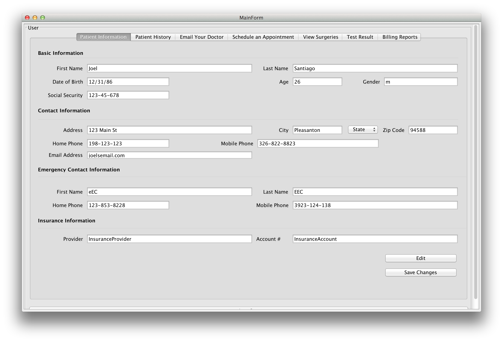
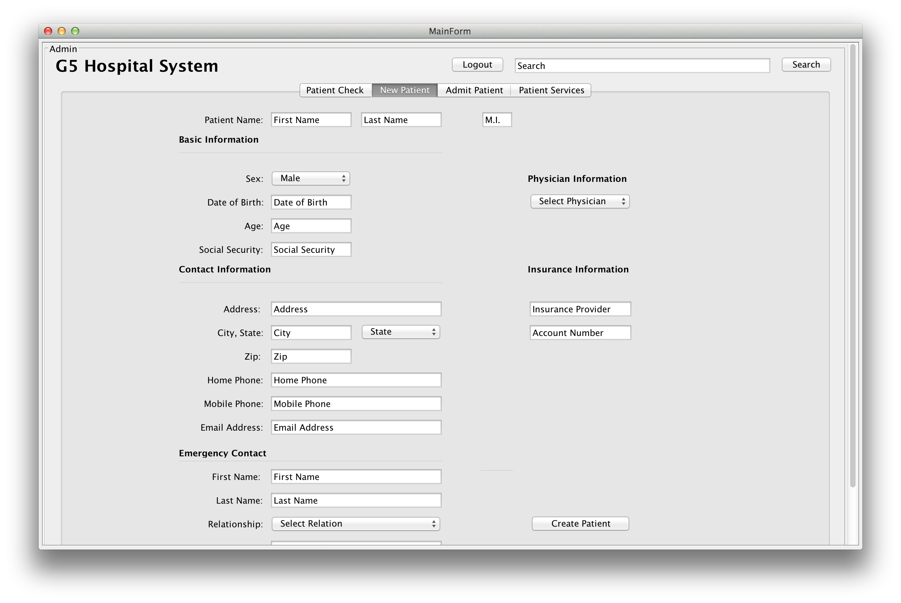
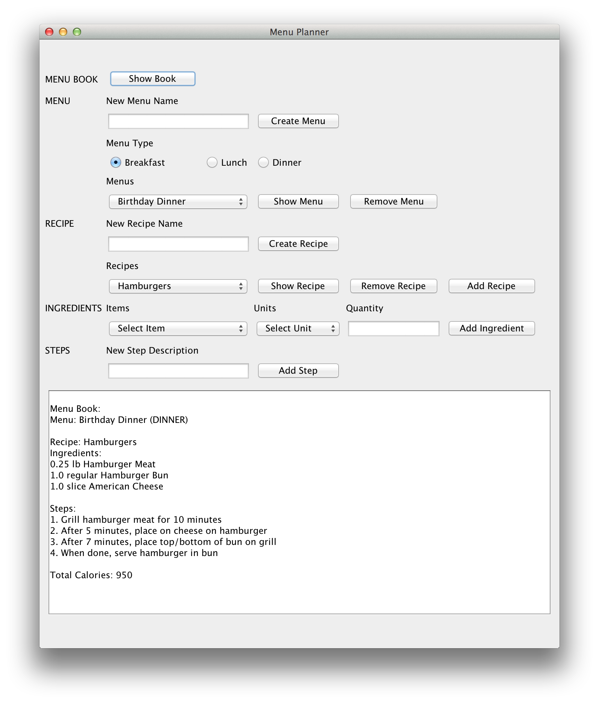
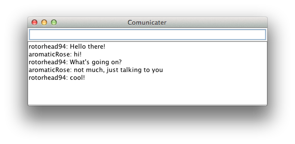
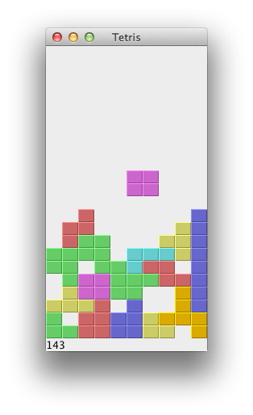

# Java Projects & Files

>This repo contains a collection of Java files and projects that were used to learn the language.  Some files were part of assignments that were done for classes, others are just small projects I accomplished on the side.

## Table of Contents
* [Projects](#Projects)
* [Socket Programming](#SocketProgramming)
* [Various Files](#VariousFiles)
* [Games](#Games)

## Projects

* #### Hospital App
  A Hospital management application created for both doctors and patients.  Patients are able to manage their medical history, schedule appointments, and contact their doctor among other things.  Doctors are able to check patient history, create a new patient in the system, and view patient services.  Currently, data within the application writes to vectors and arrays, but information was initially intended to be stored within a database.
 
  This was a project for a Software Engineering class in which I collaborated with 3 others to get it done within a short time frame.  Mockups for the initial concept are available for view within the directory.  
 
  _Client view_
  
  _Admin view_
  

* #### MenuBook
  A menubook organization applet that allows the user to create new menus, add new recipes, select and add new ingredients to menus, and create a series of steps necessary for each menu item.  Generated output is displayed within the textbox.
 

## Socket Programming

* #### Group Messaging App - Communicator
  A Simple chat client that runs on the server and allows many clients to join in.  Each client creates a username that gets displayed with each message written to the chat room.  
  
  Currently, the GUI is just a text field and a text box, with the user name creation appearing within an Option popup.
      

* #### TCPclient & TCPserver
Basic client server programs using TCP methodology to create a socket connection between two computers.  This is a one way socket connection in which the client can send messages that are then displayed on the server side.

  _CLI prompts:_
  * Client: _TCPclient hostname port_
  * Server: _TCPserver port_

* #### TCPmulticlient & TCPmultiserver
A multi user chat application that is similar to the Group Messaging app - Communicator, but is entirely CLI based.  This version lacks the separate user names for each client, displaying everyone under the same name.

  _CLI prompts:_
  * Client: _TCPmulticlient hostname port_
  * Server: _TCPmultiserver port_

* #### UDPclient & UDPserver
This is a simple socket program that uses UDP methodology to open a connection between a server and client.  The client is able to send multiple messages to the server until "Quit" is entered.  Every message that the server recieves is converted to UPPERCASE and is sent back to the client.

  _CLI prompts:_
  * Client: _UDPclient hostname port_
  * Server: _UDPserver port_
  

## Various Files

* #### ArrayList
  A class that uses the Person class to insert new objects into an Array List and then display the output.

* #### CompositePattern
  The CompositePattern class creates objects A-D and adds elements E-I to the composite objects.  Then the getTotal method is called on the root object A to output the total number of objects.

* #### Person
  This is a class that is utilized for several other files (ArrayList, VectorTest & all of the Stack classes).  Person contains just a bit of information for a Person.
  
* #### Shape
  Shape class is an abstract class that results in the calculation of the area of several different shapes.  This is accomplished by the instantiation of the Trapezoid and Polygon classes which extend Shape, and then instantiation of other classes that extend those two.

* #### Stack
  A simple example of a stack using an array that instantiates the Person class to store data.  

* #### StackAHM (ArrayList & HashMap)
  An iteration of the Stack class that instead of using an array, utilizes both an Array list and a HashMap to store Person objects and to iterate through both and display the results.

* #### StackException
  This version of the Stack class implements try & catch style programming for exception handling.  In the case of this example, a Full and an Empty exception can be caught and reported if the stack is either full or empty, respectively.  Like the other Stack examples, this class uses the Person class as it's data source.
  
  This specific example purposely pushes another Person object once the stack is full, throwing a FullException.  It then proceeds to empty the stack, and again, purposely pops one extra object from the class throwing an EmptyException.

* #### StackLL
  A simple expansion of the standard stack class, StackLL uses a linked list as its data structure.
  
* #### StackVector
  As the name suggests, this version of the Stack class uses a Vector as it's data structure. StackVector also implements try & catch style programming to check for either and Full Exception or an Empty Exception depending on the current state of the stack.

* #### VectorTest
  Like ArrayList, the VectorTest class uses the Person class to insert new objects into the a vector and iterate through and display the data.

## Games

* #### Tetris
  This was a project from the [Zetcode Tetris Tutorial].  
  
  [Zetcode Tetris Tutorial]:http://zetcode.com/tutorials/javaswingtutorial/thetetrisgame